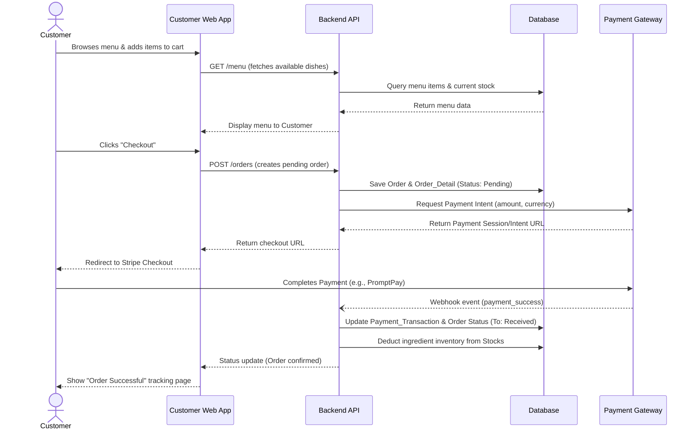
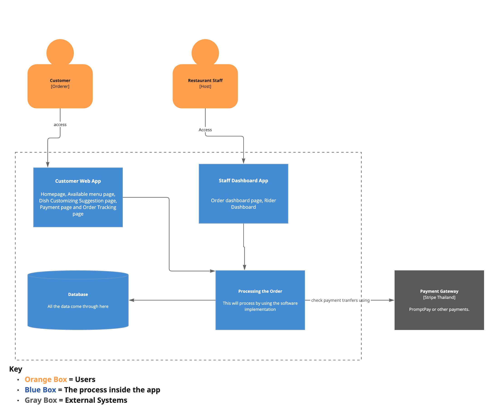

# Architecture Overview

## Context

Provide a description of the system, its purpose and its external actors (users, services). Include a simple context diagram or bullet list of external dependencies.

## Components / Containers

Based on the system architecture, the platform is divided into three major categories: Users, Internal Processes (Apps and Databases), and External Systems. Below is a detailed breakdown of each component and its role in the system.

### 1. Users (Actors)
- **Customer [Orderer]**: The end-user of the system who browses the menu, places orders, makes payments, and tracks order statuses. They interact directly with the Customer Web App and rely on Keycloak for secure registration and authentication.
- **Restaurant Staff [Host]**: The operational users managing the restaurant. They use the Staff Dashboard App to view incoming orders, manage preparation workflows, coordinate with riders, and update the system. They also authenticate securely via Keycloak.

### 2. Internal Processes (The Apps)
These are the core software components developed and maintained internally.

- **Customer Web App (Frontend)**
  - **Type**: Single Page Application (SPA)
  - **Tech Stack**: React, TypeScript, Vite
  - **Responsibilities**: Provides the primary interface for customers. It handles several key screens, including:
    - *Homepage*: The main landing page.
    - *Available Menu Page*: Displays categories and available dishes.
    - *Dish Customizing Suggestion Page*: Allows customers to add modifiers, toppings, and options to their dishes.
    - *Payment Page*: The checkout flow integrated securely with the backend and Stripe.
    - *Order Tracking Page*: Real-time or polled updates on the preparation and delivery status of the order.

- **Staff Dashboard App (Frontend)**
  - **Type**: Single Page Application (SPA)
  - **Tech Stack**: React, TypeScript, Vite
  - **Responsibilities**: The control center for restaurant operations. Key modules include:
    - *Order Dashboard Page*: A real-time view of all incoming, preparing, and completed orders, allowing staff to transition order states.
    - *Rider Dashboard*: Facilitates the handoff of prepared orders to delivery riders.

- **Processing the Request (Backend API)**
  - **Type**: RESTful API Application
  - **Tech Stack**: Kotlin, Spring Boot
  - **Responsibilities**: The brain of the operation. This software implementation sits behind the web apps and coordinates all business logic. It exposes REST endpoints consumed by the frontends, validates incoming requests, enforces business rules (like menu availability or pricing), and securely communicates with both the Database and external services like Keycloak and Stripe.

- **Database**
  - **Type**: Relational Database Management System (RDBMS)
  - **Tech Stack**: PostgreSQL
  - **Responsibilities**: The central source of truth where "all the data comes through". It persistently stores users, menu items, orders, financial records, and restaurant configurations. The backend API is the only component that directly reads from and writes to this database.

### 3. External Systems
These are third-party services that the system integrates with to offload complex or highly-sensitive responsibilities.

- **Keycloak (Identity & Access Management)**
  - **Type**: Open-Source Identity Provider
  - **Responsibilities**: Provides free, secure account creation, login, and session management. Instead of building custom authentication, both the Customer Web App and Staff Dashboard App redirect to Keycloak for secure login. The backend API then verifies the Keycloak tokens to authorize requests.

- **Payment Gateway [Stripe Thailand]**
  - **Type**: Financial Processing API
  - **Responsibilities**: Handles the actual transfer of funds (such as PromptPay or credit cards). The backend API securely communicates with Stripe to initiate checkout sessions and verify successful payment transfers via webhooks, ensuring that sensitive payment data never touches the internal database.

## Data Model

The system's data model is organized into six main functional domains, representing the core operations of the restaurant platform (comprising 23 tables in total).

### Domain Overview

1. **Users (Blue)**: Manages authentication and authorization via Keycloak. Includes the main `Users` entity and role-specific data such as `Customers` (tracking loyalty/points), `Staff_Schedule` (managing shifts), and staff-store relationships.
2. **Store (Red)**: The central `Store` entity holds restaurant details, location, and operating hours. It links to an `Owner_User_ID`.
3. **Menu Items (Yellow)**: A comprehensive catalog system. `Menu_Items` belong to a `Menu_Category` and have a `Menu_Status`. Complex customizations are handled via `Option_Groups` (e.g., Size, Toppings) and `Option_Choices`. `Menu_Recipe` and `Option_Ingredients` map items and choices to actual physical inventory.
4. **Orders and Cart (Purple)**: Tracks customer purchases. An `Order` contains multiple `Order_Detail` lines. Each detail can have specific `Order_Item_Selections` (mapping to option choices). Order lifecycle is tracked via `Order_Status_Log` and an `Order_Status_Dictionary`.
5. **Payment and Transaction (Green)**: Handles financial transactions. `Payment_Transaction` records payments against orders using a `Payment_Method`. It also includes a robust `Refund_Credit` system and `Financial_Record` for store accounting.
6. **Stocks (Pink)**: Manages physical inventory. `Stocks` are categorized by `Stock_Category` and represent raw ingredients that are consumed via menu recipes and option ingredients.

## Key Flows

The system relies on several core end-to-end flows to ensure a seamless experience for customers and efficient operations for restaurant staff.

### 1. User Authentication Flow
- **Initiation**: A Customer member opens their respective web application.
- **Redirection**: If unauthenticated, the app redirects the user to the **Keycloak** login page.
- **Authentication**: The user enters their credentials. Upon successful login, Keycloak issues a secure JWT (JSON Web Token).
- **Session**: The web app stores the token and includes it in the `Authorization` header of all subsequent API requests made to the **Backend API**.
- **Validation**: The Backend API validates the Keycloak token before processing any request, ensuring secure data access.

### 2. Order Placement and Payment Flow
This is the core customer journey from selecting a dish to successfully completing a transaction.

### 3. Order Fulfillment Flow (Staff Operations)
- **Order Display**: The **Staff Dashboard App** requests the latest orders from the **Backend API** and displays incoming paid orders.
- **Preparation**: A Staff member accepts the order. The app sends a request to the backend to update the status from `Received` to `Preparing`.
- **Database Update**: The backend logs the status change in the `Order_Status_Log` table and updates the core `Orders` table.
- **Customer Tracking**: The Customer Web App retrieves the updated status, allowing the customer to track their food in real-time.
- **Delivery/Handoff**: Once the food is ready, the Staff marks it as `Delivered` or `Completed` on the Rider Dashboard, finalizing the lifecycle of the order.

## External Dependencies

The system architecture explicitly depends on two external gray-box systems to handle specialized responsibilities securely:

1. **Keycloak (Identity & Access Management)**:
   - **Role**: Free secure open-source system that allows users to create accounts and connect to the app.
   - **Interaction**: Both the Customer and the Restaurant Staff rely on Keycloak for registration and login help. It sits outside the core app process but integrates directly with "Processing the Request" (the backend) to ensure all API calls are properly authenticated.
   
2. **Payment Gateway [Stripe Thailand]**:
   - **Role**: External service to process financial transactions like PromptPay or other payment methods.
   - **Interaction**: The backend "Processing the Request" component uses Stripe to check and verify payment transfers. This abstracts the security complexities of payment processing away from our internal application and database, reducing liability while handling customer funds.

## Decisions and Trade‑offs

Our architectural decisions focus on delivering a functional Minimum Viable Product (MVP) quickly while maintaining security and stability.

### 1. Monorepo Strategy (See [ADR 001](adrs/0001-use-simple-monolithic-backend.md))
- **Decision**: We have decided to adopt a Monorepo strategy, housing our React frontends and Kotlin/Spring Boot backend within a single Git codebase.
- **Trade-offs**: This simplifies local Docker orchestration and allows for synchronized full-stack pull requests, which is highly beneficial for our small team size and tight timeline. However, it means our CI/CD pipelines will require more complex configuration to selectively trigger builds only for the directories that changed, and the repository size may grow significantly over time.

### 2. Delegating Identity to Keycloak
- **Decision**: Instead of building custom authentication and password storage, we are using Keycloak as our Identity Provider.
- **Trade-offs**: This dramatically improves system security and reduces development time by offloading session management and role-based access control. The trade-off is introducing a significant infrastructural dependency that must be hosted, configured, and maintained separately from our core application code.

### 3. Offloading Payment Processing to Stripe
- **Decision**: Using the Stripe Thailand API to process all financial transactions (e.g., PromptPay, cards).
- **Trade-offs**: This keeps our backend out of PCI-compliance scope and shifts the liability of handling raw financial data to a trusted third party. The trade-offs include paying per-transaction fees and being forced to design our checkout flows to handle asynchronous webhook events (e.g., dealing with network delays or payment processing failures idempotently).

## C4 Diagrams

