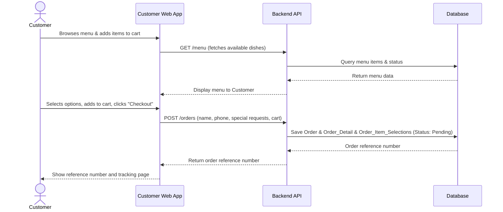

# Architecture Overview

> **Note (2026-07-05):** This page originally described a larger system (Stripe payment, rider/delivery dashboard, real-time delivery map) drafted early in the project. ADR 002 descoped payment, delivery, and financial reporting, and ADR 002-D later reinstated automatic stock deduction and a narrow refund-credit ledger. This page has been rewritten to describe the system as actually built. See `docs/architecture/adrs/` for the decision history.

## Context

CityBite Bangkok's system is a single-location, web-based ordering and order-management platform. It replaces informal order intake over walk-ins, phone calls, and chat with one shared system so customers and staff see the same order state.

**External actors:**
- **Customer** — unauthenticated guest who browses the menu, places an order, and tracks its status by reference number.
- **Restaurant Staff** — authenticated (`STAFF` role) employee who manages the order inbox, menu availability, and stock.
- **Owner** — authenticated (`OWNER` role) employee with the same visibility as staff, currently read-only for advanced management features.

**External dependencies:**
- **Keycloak** — identity provider for staff/owner authentication and role management. Customers are not authenticated.
- No other third-party service is integrated. There is no payment gateway, delivery/mapping service, or SMS/email provider in the active system.

## Components / Containers

Based on the system architecture, the platform is divided into three major categories: Users, Internal Processes (Apps and Databases), and External Systems. Below is a detailed breakdown of each component and its role in the system.

### 1. Users (Actors)
- **Customer [Orderer]**: The end-user of the system who browses the menu, submits orders as a guest, and tracks order status. They interact directly with the Customer Web App. No account or authentication is required.
- **Restaurant Staff / Owner [Host]**: The operational users managing the restaurant. They use the Staff Dashboard App to view incoming orders, advance preparation status, manage menu availability, and manage stock. They authenticate via Keycloak (`STAFF` or `OWNER` role).

### 2. Internal Processes (The Apps)
These are the core software components developed and maintained internally.

- **Customer Web App (Frontend)**
  - **Type**: Single Page Application (SPA)
  - **Tech Stack**: React, TypeScript, Vite
  - **Responsibilities**: Provides the primary interface for customers. It handles several key screens, including:
    - *Homepage*: The main landing page.
    - *Available Menu Page*: Displays categories, with available items shown before unavailable ones.
    - *Item Customization*: Lets customers pick from predefined option groups (e.g., spice level, add-ons) before adding an item to the cart.
    - *Cart / Checkout*: Collects name, phone number, and special requests, then submits the order. No payment is collected — payment happens offline (ADR 002-A).
    - *Order Tracking Page*: Shows the current status (Pending / In Kitchen / Ready) for a submitted order, looked up by reference number.

- **Staff Dashboard App (Frontend)**
  - **Type**: Single Page Application (SPA)
  - **Tech Stack**: React, TypeScript, Vite
  - **Responsibilities**: The control center for restaurant operations. Key modules include:
    - *Order Dashboard Page*: A view of all submitted orders sorted by submission time, letting staff open an order's full detail and advance it through Pending → In Kitchen → Ready, or cancel it.
    - *Menu Configuration*: Add/edit menu items and toggle item availability.
    - *Stock Management*: View, add, and adjust stock quantities by category (see Data Model below for how this ties into order acceptance).
    - *Staff / Owner Profile & Staff List*: View and edit account details; owner can view and manage the staff roster.
  - There is no rider/delivery-handoff module — delivery and rider management are out of scope (product brief).

- **Processing the Request (Backend API)**
  - **Type**: RESTful API Application
  - **Tech Stack**: Kotlin, Spring Boot
  - **Responsibilities**: The brain of the operation. This software implementation sits behind the web apps and coordinates all business logic. It exposes REST endpoints consumed by the frontends, validates incoming requests, enforces business rules (menu availability, stock sufficiency, order status transitions), and communicates with the Database and Keycloak. There is no payment gateway integration.

- **Database**
  - **Type**: Relational Database Management System (RDBMS)
  - **Tech Stack**: PostgreSQL
  - **Responsibilities**: The central source of truth where "all the data comes through". It persistently stores users, menu items, orders, financial records, and restaurant configurations. The backend API is the only component that directly reads from and writes to this database.

### 3. External Systems
These are third-party services that the system integrates with to offload complex or highly-sensitive responsibilities.

- **Keycloak (Identity & Access Management)**
  - **Type**: Open-Source Identity Provider
  - **Responsibilities**: Provides free, secure account creation, login, and session management. The Staff Dashboard App redirects to Keycloak for secure login. The backend API then verifies the Keycloak tokens to authorize requests. Customers do not authenticate and Keycloak is not involved in the customer-facing flow.

No payment gateway or other third-party service is active in the current implementation (ADR 002-A).

## Data Model

The database schema (23 tables) was originally designed for a larger system than the active MVP. The domains below note which parts are actively used by the backend today.

### Domain Overview

1. **Users**: Manages authentication and authorization via Keycloak. Includes the main `Users` entity and role-specific data such as `Staff` and staff-store relationships. `Staff_Schedule` / `LeaveDay` exist in schema but have no active service or UI (out of scope).
2. **Store**: The central `Store` entity holds restaurant details and open/closed state, controlled by staff/owner. It links to an `Owner_User_ID`.
3. **Menu Items**: `Menu_Items` belong to a `Menu_Category` and have a `Menu_Status` (available/unavailable). Customizations are handled via `Option_Groups` (e.g., spice level, add-ons) and `Option_Choices`. `Menu_Recipe` and `Option_Ingredients` map items and choices to `Stock` rows and are **actively used** to compute and deduct ingredient requirements (see Key Flows).
4. **Orders and Cart**: Tracks customer purchases. An `Order` contains multiple `Order_Detail` lines. Each detail can have specific `Order_Item_Selections` (mapping to option choices). Order lifecycle (Pending → In Kitchen → Ready, or Canceled) is tracked via `Order_Status_Log` and an `Order_Status_Dictionary`.
5. **Payment and Transaction**: `Payment_Transaction`, `Payment_Method`, and `Financial_Record` exist in the schema but are **not connected to any active service or API** (ADR 002-B) — no real payment is processed and there is no financial reporting. The exception is `Refund_Credit` / `Refund_Credit_Log`, which **is** active: staff-initiated order cancellation credits the customer's balance, redeemable at a later checkout (ADR 002-D).
6. **Stocks**: `Stocks` are categorized by `Stock_Category` and represent raw ingredients. **Actively consumed** on order acceptance via menu recipes and option ingredients, and restored on cancellation (ADR 002-D). Staff can also add/adjust stock quantities directly through the Stock Management UI.

## Key Flows

The system relies on several core end-to-end flows to ensure a seamless experience for customers and efficient operations for restaurant staff.

### 1. User Authentication Flow
- **Initiation**: A Customer member opens their respective web application.
- **Redirection**: If unauthenticated, the app redirects the user to the **Keycloak** login page.
- **Authentication**: The user enters their credentials. Upon successful login, Keycloak issues a secure JWT (JSON Web Token).
- **Session**: The web app stores the token and includes it in the `Authorization` header of all subsequent API requests made to the **Backend API**.
- **Validation**: The Backend API validates the Keycloak token before processing any request, ensuring secure data access.

### 2. Order Placement Flow
This is the core customer journey from browsing the menu to receiving an order reference number. There is no payment step — payment happens offline, outside the system.

### 3. Order Fulfillment Flow (Staff Operations)
- **Order Display**: The **Staff Dashboard App** requests all submitted orders from the **Backend API** and displays them sorted by submission time (Pending first).
- **Acceptance**: A staff member claims a pending order. The backend attempts to deduct the required stock (via `Menu_Recipe` / `Option_Ingredients`) and, only if sufficient stock exists, advances the order to **In Kitchen**. If stock is insufficient, the order is automatically canceled instead.
- **Completion**: Staff advance the order from **In Kitchen** to **Ready**.
- **Cancellation**: Staff can cancel an order that is Pending or In Kitchen. Canceling an In Kitchen order restores any stock already deducted and credits the customer's `Refund_Credit` balance.
- **Database Update**: Every transition is logged in `Order_Status_Log` and the `Orders` table is updated.
- **Customer Tracking**: The Customer Web App polls the order status by reference number, so the customer sees the same Pending / In Kitchen / Ready state staff see. There is no delivery or rider hand-off step in the active system.

## External Dependencies

The system architecture depends on one external gray-box system:

1. **Keycloak (Identity & Access Management)**:
   - **Role**: Free secure open-source system that allows staff/owner accounts to be created (via the Admin Console — no self-registration) and to log in.
   - **Interaction**: The Staff Dashboard App relies on Keycloak for login. It sits outside the core app process but integrates directly with "Processing the Request" (the backend) to ensure all protected API calls are properly authenticated. Customers do not interact with Keycloak.

There is no payment gateway or delivery/mapping service integrated (ADR 002-A; product brief out-of-scope list).

## Decisions and Trade‑offs

Our architectural decisions focus on delivering a functional Minimum Viable Product (MVP) quickly while maintaining security and stability.

### 1. Monorepo Strategy (See [ADR 001](adrs/0001-use-simple-monolithic-backend.md))
- **Decision**: We have decided to adopt a Monorepo strategy, housing our React frontends and Kotlin/Spring Boot backend within a single Git codebase.
- **Trade-offs**: This simplifies local Docker orchestration and allows for synchronized full-stack pull requests, which is highly beneficial for our small team size and tight timeline. However, it means our CI/CD pipelines will require more complex configuration to selectively trigger builds only for the directories that changed, and the repository size may grow significantly over time.

### 2. Delegating Identity to Keycloak
- **Decision**: Instead of building custom authentication and password storage, we are using Keycloak as our Identity Provider.
- **Trade-offs**: This dramatically improves system security and reduces development time by offloading session management and role-based access control. The trade-off is introducing a significant infrastructural dependency that must be hosted, configured, and maintained separately from our core application code.

### 3. Deferring Payment Processing (See [ADR 002-A](adrs/0002-scope-reduction-decisions.md))
- **Decision**: An earlier draft of this architecture planned to integrate Stripe Thailand for PromptPay/card payments. This was deferred entirely for the MVP — orders are recorded without any financial transaction, and payment is handled offline between customer and staff.
- **Trade-offs**: This keeps the team focused on the core order-intake and staff-review workflow within the remaining timeline, at the cost of the MVP not being usable for real commercial transactions yet.

### 4. Reinstating Recipe-Based Stock Deduction (See [ADR 002-D](adrs/0002-scope-reduction-decisions.md))
- **Decision**: Automatic stock deduction (originally deferred) was implemented after all once the order-acceptance flow stabilized. Accepting an order deducts the stock required by `Menu_Recipe` / `Option_Ingredients`; canceling an in-progress order restores it and credits the customer's `Refund_Credit` balance.
- **Trade-offs**: This directly addresses the case's "item was unavailable but still requested" problem, but makes order acceptance depend on recipe data being correctly maintained — a menu item with no recipe rows will deduct nothing.

## C4 Diagrams

> **Note:** This diagram was drawn early in the project and may still show the originally-planned Stripe payment gateway and rider/delivery components described above. The text sections above are the authoritative description of the current system; the diagram is scheduled to be redrawn to match ADR 002 / 002-D before final submission.