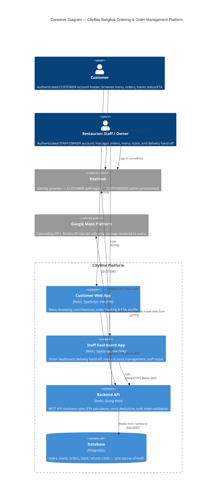

# Architecture Overview

> **Note (2026-07-09):** This page originally described a larger system (Stripe payment, a separate rider/delivery dashboard, real-time delivery map) drafted early in the project. ADR 002 descoped payment, delivery, and financial reporting; ADR 002-D reinstated automatic stock deduction and a narrow refund-credit ledger; ADR 002-E reinstated order tracking, ETA, and delivery hand-off — implemented on top of the existing `STAFF` role rather than a separate rider role/app, and as an authenticated customer feature (see below), not a guest one. This page has been rewritten to describe the system as actually built. See `docs/architecture/adrs/` for the decision history.

## Context

CityBite Bangkok's system is a single-location, web-based ordering and order-management platform. It replaces informal order intake over walk-ins, phone calls, and chat with one shared system so customers, staff, and management see the same order state.

**External actors:**
- **Customer** — authenticated (`CUSTOMER` role) account holder who logs in (self-registered, no admin provisioning needed) to browse the menu, place an order, and track its status and ETA (a prep-time-plus-travel-time window, not a location).
- **Restaurant Staff** — authenticated (`STAFF` role) employee who manages the order inbox, menu availability, stock, and delivery hand-off. Any staff member can claim an in-preparation order for delivery from the same `STAFF` login used for the rest of the dashboard — there is no separate rider role or account type, and no location is reported back to the system.
- **Owner** — authenticated (`OWNER` role) employee with the same visibility as staff, currently read-only for advanced management features.

**External dependencies:**
- **Keycloak** — identity provider for customer/staff/owner authentication and role management (`CUSTOMER`, `STAFF`, `OWNER`).
- **Google Maps Platform (Geocoding API + Routes API)** — Geocoding resolves a customer address to latitude/longitude when it's saved or edited; Routes (`travelMode: TWO_WHEELER`) estimates travel time from the store to that address for the ETA calculation. No map is rendered to any user — these APIs are called server-side only, for numbers, not tiles. Requires a billed, keyed Google Maps API key.
- No payment gateway or SMS/email provider is integrated in the active system.

## Components / Containers

Based on the system architecture, the platform is divided into three major categories: Users, Internal Processes (Apps and Databases), and External Systems. Below is a detailed breakdown of each component and its role in the system.

### 1. Users (Actors)
- **Customer [Orderer]**: The end-user of the system who logs in with their own account, browses the menu, submits orders, and tracks order status, ETA, and delivery location. They interact directly with the Customer Web App and authenticate via Keycloak (`CUSTOMER` role). Unlike staff/owner, customer accounts are self-registered through a signup form — no admin action is needed to create one.
- **Restaurant Staff / Owner [Host]**: The operational users managing the restaurant. They use the Staff Dashboard App to view incoming orders, advance preparation status, manage menu availability, manage stock, and claim/perform delivery hand-off on in-preparation orders. They authenticate via Keycloak (`STAFF` or `OWNER` role), provisioned by an admin via the Keycloak Admin Console — the same staff account is used whether an employee is working the counter or out making a delivery; there is no separate rider role.

### 2. Internal Processes (The Apps)
These are the core software components developed and maintained internally.

- **Customer Web App (Frontend)**
  - **Type**: Single Page Application (SPA)
  - **Tech Stack**: React, TypeScript, Vite
  - **Responsibilities**: Provides the primary interface for customers. It handles several key screens, including:
    - *Login / Signup*: Customers log in or self-register via Keycloak before browsing or ordering.
    - *Homepage*: The main landing page.
    - *Available Menu Page*: Displays categories, with available items shown before unavailable ones.
    - *Item Customization*: Lets customers pick from predefined option groups (e.g., spice level, add-ons) before adding an item to the cart.
    - *Cart / Checkout*: Collects name, phone number, and special requests, then submits the order. No payment is collected — payment happens offline (ADR 002-A).
    - *Order Tracking Page*: Part of the authenticated customer app — shows a 4-step progress bar (Pending / In Preparation / On Delivery / Delivered) and an ETA card (a prep-time-plus-travel-time window, with a prep/travel-minutes breakdown), polling every 30 seconds, for any order belonging to the logged-in customer (ADR 002-E). No map or location is shown.
    - *Order History / Profile*: View past orders and reorder, and manage account details (name, phone, email, password).

- **Staff Dashboard App (Frontend)**
  - **Type**: Single Page Application (SPA)
  - **Tech Stack**: React, TypeScript, Vite
  - **Responsibilities**: The control center for restaurant operations. Key modules include:
    - *Order Dashboard Page*: A view of all submitted orders sorted by submission time, letting staff open an order's full detail and advance it through Pending → In Preparation → On Delivery → Delivered, or cancel it (from Pending or In Preparation). There is no separate "Ready" status — an order moves directly from In Preparation to On Delivery once a staff member claims the delivery.
    - *Delivery Hand-off*: Any `STAFF`/`OWNER` can click "Deliver" on an in-preparation order — the same claim pattern used for accepting a pending order, not a manager assigning a colleague. Clicking it sets that order's assigned staff to whoever clicked and advances it to On Delivery. Only that same staff member can later mark it Delivered (enforced server-side; anyone else gets a 403). No location is reported by the device, and there is no separate rider role or app.
    - *Menu Configuration*: Add/edit menu items and toggle item availability.
    - *Stock Management*: View, add, and adjust stock quantities by category (see Data Model below for how this ties into order acceptance).
    - *Staff / Owner Profile & Staff List*: View and edit account details; owner can view and manage the staff roster.

- **Processing the Request (Backend API)**
  - **Type**: RESTful API Application
  - **Tech Stack**: Kotlin, Spring Boot
  - **Responsibilities**: The brain of the operation. This software implementation sits behind the web apps and coordinates all business logic. It exposes REST endpoints consumed by the frontends, validates incoming requests, enforces business rules (menu availability, stock sufficiency, order status transitions), computes ETA (a hardcoded store location, a flat 15-minute prep constant, a Google Routes API travel-time call, and a 10-minute buffer), geocodes customer addresses via the Google Geocoding API, and communicates with the Database and Keycloak. There is no payment gateway integration.

- **Database**
  - **Type**: Relational Database Management System (RDBMS)
  - **Tech Stack**: PostgreSQL
  - **Responsibilities**: The central source of truth where "all the data comes through". It persistently stores users, menu items, orders, financial records, and restaurant configurations. The backend API is the only component that directly reads from and writes to this database.

### 3. External Systems
These are third-party services that the system integrates with to offload complex or highly-sensitive responsibilities.

- **Keycloak (Identity & Access Management)**
  - **Type**: Open-Source Identity Provider
  - **Responsibilities**: Provides free, secure account creation, login, and session management. Both the Customer Web App (`CUSTOMER` role, self-registration enabled) and the Staff Dashboard App (`STAFF`/`OWNER` roles, admin-provisioned only — delivery hand-off uses the same `STAFF` login, no separate role) redirect to Keycloak for secure login. The backend API then verifies the Keycloak tokens to authorize requests, including the customer tracking endpoint.

- **Google Maps Platform (Geocoding API + Routes API)**
  - **Type**: Paid, keyed third-party mapping/location service
  - **Responsibilities**: `GeocodingService` calls the Google Geocoding API to resolve a customer's saved address to latitude/longitude when it's created or edited. `OrderETAService` calls the Google Routes API (`travelMode: TWO_WHEELER`) to estimate travel time from the store's (hardcoded) coordinates to the customer's geocoded address, used as part of the ETA window. No tiles or maps are ever rendered to a user. If geocoding fails or the API key is unset, ETA degrades gracefully to an "unavailable" message rather than erroring.

No payment gateway or other paid third-party service is active in the current implementation (ADR 002-A).


## Data Model

The database schema (23 tables) was originally designed for a larger system than the active MVP. The domains below note which parts are actively used by the backend today.

### Domain Overview

1. **Users**: Manages authentication and authorization via Keycloak (`CUSTOMER`, `STAFF`, `OWNER` roles — see ADR 002-C). Includes the main `Users` entity and role-specific data such as `Staff` and staff-store relationships. `Staff_Schedule` / `LeaveDay` exist in schema but have no active service or UI (out of scope).
2. **Store**: The central `Store` entity holds restaurant details and open/closed state, controlled by staff/owner. It links to an `Owner_User_ID`.
3. **Menu Items**: `Menu_Items` belong to a `Menu_Category` and have a `Menu_Status` (available/unavailable). Customizations are handled via `Option_Groups` (e.g., spice level, add-ons) and `Option_Choices`. `Menu_Recipe` and `Option_Ingredients` map items and choices to `Stock` rows and are **actively used** to compute and deduct ingredient requirements, and their per-item `prep_minutes` feed the ETA calculation (see Key Flows).
4. **Orders and Cart**: Tracks customer purchases, linked to the authenticated `Users` row that placed them. An `Order` contains multiple `Order_Detail` lines, and carries a customer-facing `reference_number` generated at submission (ADR 002-E) shown as a receipt/lookup label — independent of the internal `id`. Each detail can have specific `Order_Item_Selections` (mapping to option choices). Order lifecycle is `PENDING` → `IN_PREPARATION` → `ON_DELIVERY` → `DELIVERED`, cancelable (`CANCELED`) from `PENDING` or `IN_PREPARATION`; there is no separate "Ready" status. Transitions are tracked via `Order_Status_Log` and an `Order_Status_Dictionary`.
5. **Payment and Transaction**: `Payment_Transaction`, `Payment_Method`, and `Financial_Record` exist in the schema but are **not connected to any active service or API** (ADR 002-B) — no real payment is processed and there is no financial reporting. The exception is `Refund_Credit` / `Refund_Credit_Log`, which **is** active: staff-initiated order cancellation credits the customer's balance, redeemable at a later checkout (ADR 002-D).
6. **Stocks**: `Stocks` are categorized by `Stock_Category` and represent raw ingredients. **Actively consumed** on order acceptance via menu recipes and option ingredients, and restored on cancellation (ADR 002-D). Staff can also add/adjust stock quantities directly through the Stock Management UI.
7. **Delivery Hand-off**: No `Delivery_Assignment` or `Rider` entity exists. The `Order` row itself carries a reference to the `Staff` member who claimed it for delivery (set when a `STAFF`/`OWNER` user clicks "Deliver" on an in-preparation order) — the same claim pattern used for accepting a pending order, not an assignment. No location or coordinates are stored anywhere (ADR 002-E).
8. **Address & Geocoding**: Each customer `Address` stores latitude/longitude populated by `GeocodingService` (Google Geocoding API) whenever the address is saved or edited. `OrderETAService` uses this geocoded address, plus a hardcoded store location, as the destination/origin for the Google Routes API travel-time call that feeds the ETA (ADR 002-E). If geocoding fails or no API key is configured, ETA degrades to "unavailable" rather than erroring.

## Key Flows

The system relies on several core end-to-end flows to ensure a seamless experience for customers and efficient operations for restaurant staff.

### 1. User Authentication Flow
- **Initiation**: A user (customer, staff, or owner) opens their respective web application.
- **Redirection**: If unauthenticated, the app redirects the user to the **Keycloak** login page (or signup page, for a new customer).
- **Authentication**: The user enters their credentials. Upon successful login, Keycloak issues a secure JWT (JSON Web Token).
- **Session**: The web app stores the token and includes it in the `Authorization` header of all subsequent API requests made to the **Backend API**.
- **Validation**: The Backend API validates the Keycloak token before processing any request, ensuring secure data access. This applies uniformly to customer, staff, and owner requests.

### 2. Order Placement Flow
This is the core customer journey from browsing the menu to receiving an order reference number. There is no payment step — payment happens offline, outside the system.

```mermaid
sequenceDiagram
    actor Customer
    participant WebApp as Customer Web App
    participant API as Backend API
    participant DB as Database

    Customer->>WebApp: Logs in (Keycloak)
    Customer->>WebApp: Browses menu & adds items to cart
    WebApp->>API: GET /menu (fetches available dishes)
    API->>DB: Query menu items & status
    DB-->>API: Return menu data
    API-->>WebApp: Display menu to Customer

    Customer->>WebApp: Selects options, adds to cart, clicks "Checkout"
    WebApp->>API: POST /orders (Authorization: Bearer <token>; name, phone, special requests, cart)
    API->>DB: Save Order (linked to Customer's Users row) & Order_Detail & Order_Item_Selections (Status: Pending, reference_number generated)
    DB-->>API: Order reference number
    API-->>WebApp: Return order reference number
    WebApp-->>Customer: Show reference number and tracking page
```

### 3. Order Fulfillment Flow (Staff Operations)
- **Order Display**: The **Staff Dashboard App** requests all submitted orders from the **Backend API** and displays them sorted by submission time (Pending first).
- **Acceptance**: A staff member claims a pending order. The backend attempts to deduct the required stock (via `Menu_Recipe` / `Option_Ingredients`) and, only if sufficient stock exists, advances the order to **In Preparation**. If stock is insufficient, the order is automatically canceled instead.
- **Delivery hand-off**: Any `STAFF`/`OWNER` user can claim an in-preparation order for delivery by clicking "Deliver" — this sets the order's assigned staff member and advances it straight to **On Delivery** (there is no intermediate "Ready" status). Only that same staff member can later mark it **Delivered**; anyone else attempting to is rejected with a 403.
- **Cancellation**: Staff can cancel an order that is Pending or In Preparation. Canceling an In Preparation order restores any stock already deducted and credits the customer's `Refund_Credit` balance.
- **Database Update**: Every transition is logged in `Order_Status_Log` and the `Orders` table is updated.
- **Customer Tracking**: The logged-in Customer Web App polls for the order's status and displays it (Pending / In Preparation / On Delivery / Delivered) alongside a computed ETA (ADR 002-E).

### 4. Order Tracking and ETA Flow
- **Authenticated ETA lookup**: The Customer Web App calls `GET /api/customer/orders/{orderId}/eta` with the customer's bearer token; the backend confirms the order belongs to the requesting customer (checked against the JWT subject) before returning an ETA window.
- **ETA Calculation**: `OrderETAService` starts from a hardcoded store latitude/longitude, adds a flat 15-minute prep-time constant (not per-item or recipe-based), calls the Google Routes API (`travelMode: TWO_WHEELER`) for travel time from the store to the customer's geocoded address, and adds a 10-minute buffer. This is recalculated on every request, not cached.
- **Graceful degradation**: If the customer's address hasn't been geocoded (geocoding failed, or no Google Maps API key is configured), the endpoint returns an "unavailable" ETA with an explanatory message instead of erroring.
- **Delivery hand-off (self-claim)**: For a delivery order, any `STAFF`/`OWNER` employee claims it directly from In Preparation — there is no separate assignment step or `Delivery_Assignment` entity. That same employee then marks it Delivered from their existing Staff Dashboard login.
- **No location tracking**: No coordinates are ever reported or stored, and no map is rendered anywhere in the system — the tracking page shows only the 4-step status progress bar and the ETA window.

## External Dependencies

The system architecture depends on two external gray-box systems:

1. **Keycloak (Identity & Access Management)**:
   - **Role**: Free secure open-source system that manages all three account types. Customers self-register (`CUSTOMER` role); staff/owner accounts are created via the Admin Console only (`STAFF`/`OWNER` roles, no self-registration). Delivery hand-off reuses existing `STAFF` accounts; no additional role or account type is provisioned.
   - **Interaction**: Both the Customer Web App and the Staff Dashboard App rely on Keycloak for login. It sits outside the core app process but integrates directly with "Processing the Request" (the backend) to ensure all protected API calls — customer, staff, and owner alike — are properly authenticated.
2. **Google Maps Platform (Geocoding API + Routes API)**:
   - **Role**: Paid, keyed service used server-side only. The Geocoding API resolves a saved customer address to latitude/longitude; the Routes API (`travelMode: TWO_WHEELER`) estimates travel time from the store to that address for the ETA calculation.
   - **Interaction**: The Backend API (not the frontend) calls both Google APIs directly using `GOOGLE_MAPS_API_KEY`. No map is rendered to any user. Note: this key is currently hardcoded in `docker-compose-local.yml` rather than sourced from an untracked `.env` file — a secret-hygiene issue tracked in `docs/handover/known-issues.md`.

There is no payment gateway integrated (ADR 002-A).

## Decisions and Trade‑offs

Our architectural decisions focus on delivering a functional Minimum Viable Product (MVP) quickly while maintaining security and stability.

### 1. Monorepo Strategy (See [ADR 001](adrs/0001-use-simple-monolithic-backend.md))
- **Decision**: We have decided to adopt a Monorepo strategy, housing our React frontends and Kotlin/Spring Boot backend within a single Git codebase.
- **Trade-offs**: This simplifies local Docker orchestration and allows for synchronized full-stack pull requests, which is highly beneficial for our small team size and tight timeline. However, it means our CI/CD pipelines will require more complex configuration to selectively trigger builds only for the directories that changed, and the repository size may grow significantly over time.

### 2. Delegating Identity to Keycloak
- **Decision**: Instead of building custom authentication and password storage, we are using Keycloak as our Identity Provider for all three roles — `CUSTOMER`, `STAFF`, and `OWNER` (ADR 002-C). Customers self-register; staff/owner accounts are admin-provisioned.
- **Trade-offs**: This dramatically improves system security and reduces development time by offloading session management and role-based access control. The trade-off is introducing a significant infrastructural dependency that must be hosted, configured, and maintained separately from our core application code.

### 3. Deferring Payment Processing (See [ADR 002-A](adrs/0002-scope-reduction-decisions.md))
- **Decision**: An earlier draft of this architecture planned to integrate Stripe Thailand for PromptPay/card payments. This was deferred entirely for the MVP — orders are recorded without any financial transaction, and payment is handled offline between customer and staff.
- **Trade-offs**: This keeps the team focused on the core order-intake and staff-review workflow within the remaining timeline, at the cost of the MVP not being usable for real commercial transactions yet.

### 4. Reinstating Recipe-Based Stock Deduction (See [ADR 002-D](adrs/0002-scope-reduction-decisions.md))
- **Decision**: Automatic stock deduction (originally deferred) was implemented after all once the order-acceptance flow stabilized. Accepting an order deducts the stock required by `Menu_Recipe` / `Option_Ingredients`; canceling an in-progress order restores it and credits the customer's `Refund_Credit` balance.
- **Trade-offs**: This directly addresses the case's "item was unavailable but still requested" problem, but makes order acceptance depend on recipe data being correctly maintained — a menu item with no recipe rows will deduct nothing.

### 5. Reinstating Order Tracking, ETA, and Delivery Hand-off (See [ADR 002-E](adrs/0002-scope-reduction-decisions.md))
- **Decision**: An authenticated ETA endpoint (scoped to the logged-in customer's own orders), an ETA estimator built on the Google Geocoding + Routes APIs, and a self-claim delivery hand-off were added once the core order lifecycle and stock deduction stabilized, completing the case brief's "know when my order will be ready" requirement. Delivery hand-off deliberately reuses the existing `STAFF` role rather than introducing a new rider role or account type, and is a claim (any `STAFF`/`OWNER` can take an in-preparation order) rather than a manager-assigned task.
- **Trade-offs**: ETA is a flat 15-minute prep constant plus a Google-estimated travel time and a 10-minute buffer, not a recipe-based or live-kitchen-load estimate. It also introduces a paid, keyed external dependency (Google Maps Platform) where the rest of the stack favors open-source/free infrastructure, and that API key is currently checked into `docker-compose-local.yml` rather than kept in an untracked `.env`. There is no location tracking of any kind — delivery hand-off is a status claim, not a live map — so the system can't enforce a separate rider permission boundary or show a customer where their order physically is.

## C4 Diagrams

